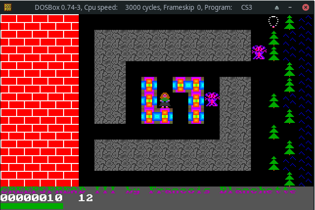
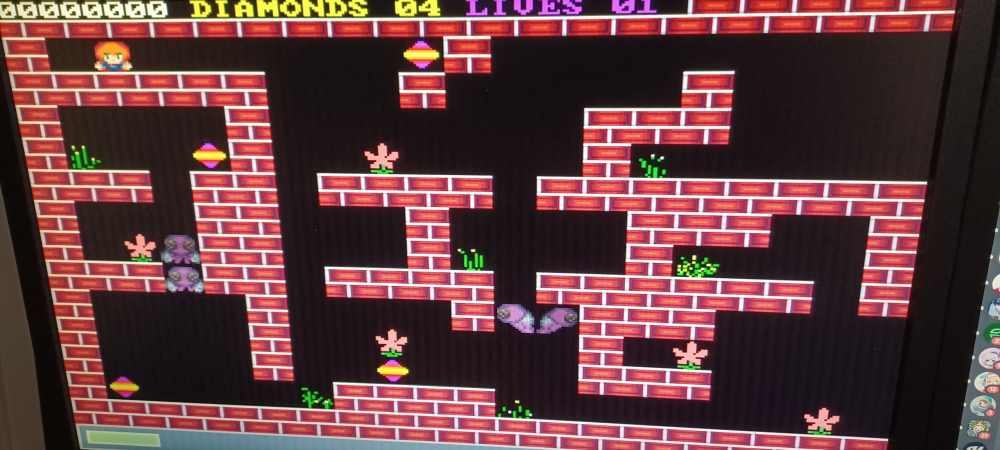

# About

This project is a game port to RP2040 (Raspberry Pico) microcontroller of an MS-DOS Game.

Current status is alpha. 90% of the core mechanic has been implemented.

## Original MS-DOS



## RP2040 VGA (GVGA library)



Gameplay: https://www.youtube.com/watch?v=SPQwWkzFRpU

I am also releasing the source code for the map editor:
https://github.com/cfrankb/cs3-map-edit

Try the online version of the game:
https://cfrankb.itch.io/creepspread-iii

# Software required

RP2040 / Pico SDK

# Installation

This project is based in part on: https://github.com/drfrancintosh/GVga

```Shell
git clone https://github.com/cfrankb/GVga-Fork.git
cd GVga-Fork/app/cs3_vga
./vmake.sh
./flashdata.sh
./update.sh
```

# Hardware

## VGA Adaptor

An adaptor is needed to communicate with the VGA Hardware.


kicad / gerber: TBA

## Gamepad


| Aim   | GPIO Pin |
| ----- | -------- |
| UP    | 18       |
| DOWN  | 19       |
| LEFT  | 20       |
| RIGHT | 21       |

```
CGameController gamepad(18, 19, 20, 21);
engine->attach(&gamepad);
```

The above configuration is for my RP2040. Pin out will vary per model.

