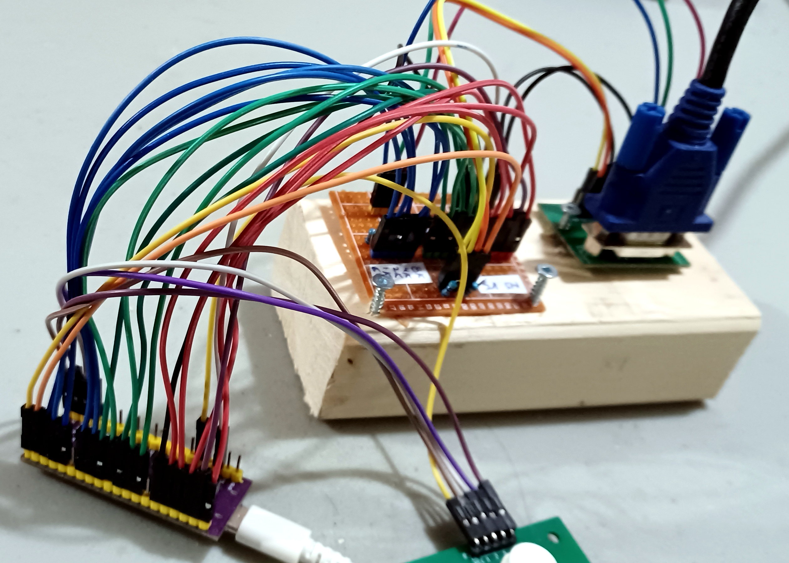
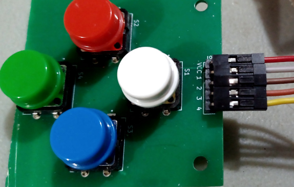

# Encoding

Colors are encoded as unsigned 16bits integer (B5G6R5).

The five (5) lowest bits are red and in accending order of brigtness. The next six (5) bits are green and the last five (5) bits are blue.


# Hardware

## ESP32-S3

Recommended ESP32S3 DevKit.

https://vi.aliexpress.com/item/1005006418608267.html

## Dupont cables

https://www.aliexpress.com/item/1005004611997111.html


## VGA Adaptor

An adaptor is needed to communicate with the VGA Hardware.


### Manually assembled


https://vi.aliexpress.com/item/1005005279582020.html




Create a resistor ladder wire as follow. Connect all the pins of the same color together.


| GPIO Pin | Role  | Resistor | VGA Pin |
| -------- | ----- | -------- | ------- |
| 0        | red   | 8k       | 1       |
| 1        | red   | 4k       |
| 2        | red   | 2k       |
| 3        | red   | 1k       |
| 4        | red   | 512R     |
| 6        | green | 8k       | 2       |
| 7        | green | 4k       |
| 8        | green | 2k       |
| 9        | green | 1k       |
| 10       | green | 512R     |
| 11       | blue  | 8k       | 3       |
| 12       | blue  | 4k       |
| 13       | blue  | 2k       |
| 14       | blue  | 1k       |
| 15       | blue  | 512R     |
| 16       | hsync | 47R      | 13      |
| 17       | vsync | 47R      | 14      |
| GND      | -     | -        | 5, 10   |

\* If you don't have any 16k Resistor. You can use a similar value such as 20k. The smallest resistor is the most significant and should be roughtly ~500R or higher.


# Gamepad




| Aim   | GPIO Pin |
| ----- | -------- |
| UP    | 18       |
| DOWN  | 19       |
| LEFT  | 20       |
| RIGHT | 21       |

```
CGameController gamepad(18, 19, 20, 21);
engine->attach(&gamepad);
```

The above configuration is for my RP2040. Pin out will vary per model.

